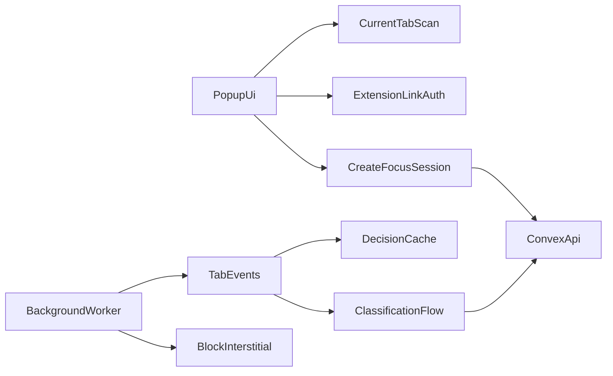

# Chrome Extension Plan

## Goal

- Add a separate React-based Chrome extension that starts a focus session, summarizes open tabs, classifies tab relevance to the user’s task, and blocks only irrelevant browsing.

## Scope

1. Create a dedicated extension workspace inside the repo.
2. Build the popup UI with React and shadcn-style components.
3. Add a background service worker for tab watching and enforcement.
4. Integrate the extension with Convex for session creation, classification, and realtime dashboard updates.

## Extension Architecture

## Implementation Plan

1. Create the extension workspace as a separate frontend in the repo.

- Add an `[extension/](extension/)` directory with:
  - `manifest.json`
  - popup entrypoint
  - background service worker
  - blocked/interstitial page
  - shared extension utilities
- Keep it separate from the Next build so extension packaging stays predictable.

2. Build the popup UI for session kickoff.

- Use React with a compact popup layout and shadcn-style components.
- On popup open:
  - query current tabs with `chrome.tabs.query`
  - gather lightweight descriptors such as title, URL, and hostname
  - display a one-sentence snapshot of the current browsing context
- After the user enters the session goal, send the task plus tab snapshot to the backend for classification.
- Show each tab as `allowed`, `blocked`, or `checking`.

3. Add extension auth/linking instead of running full WorkOS directly in the popup.

- Accept a short-lived linking code or token generated from the web dashboard.
- Store the resulting extension session/token locally in extension storage.
- Use that linked identity for all Convex calls from the popup/background worker.

4. Move enforcement logic into the background worker.

- Listen to `chrome.tabs.onUpdated`, `chrome.tabs.onActivated`, and related events.
- Re-check new tabs against the active focus session.
- Redirect irrelevant tabs to an extension-owned blocked page instead of banning a whole site globally.
- Keep the popup focused on user input and state display, not long-running tab monitoring.

5. Implement a fast, tiered classification path.

- First use local heuristics and cache:
  - exact domains/pages already allowed in this session
  - repeated distractor URLs already blocked in this session
  - manual overrides
- Only escalate uncertain cases to the backend OpenRouter classification action.
- Persist the final verdict, reason, and confidence so the dashboard can explain decisions.

6. Add the block-page UX and manual override.

- Show the user why the tab was blocked and which focus goal it conflicts with.
- Provide a temporary allow/override action for the current session.
- Sync the override back to Convex so future checks in the same session stay consistent.

## Key Files

- `[extension/manifest.json](extension/manifest.json)`
- `[extension/src/popup/](extension/src/popup/)`
- `[extension/src/background/](extension/src/background/)`
- `[extension/src/blocked/](extension/src/blocked/)`
- `[extension/src/lib/](extension/src/lib/)`

## Validation

- Verify the popup loads and reads the current tab set.
- Verify opening the popup generates a one-sentence summary of current browsing.
- Verify entering a focus goal produces relevance decisions for open tabs.
- Verify newly opened irrelevant tabs are redirected to the blocked page.
- Verify manual allow overrides work and are reflected in later checks.
- Verify the extension sends events that appear live in the dashboard.
