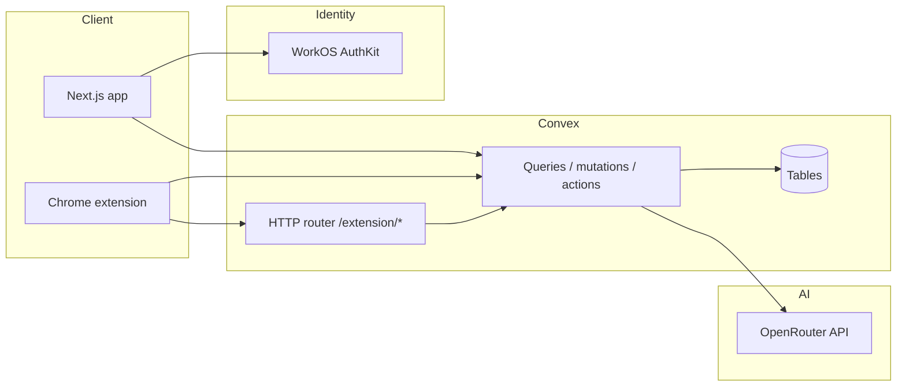

# FocusFlow (LCS Hackathon)

FocusFlow is an AI-assisted focus tool: a **Next.js** web app for sign-in, dashboards, and linking the **Chrome extension**, plus a **Convex** backend that stores sessions, tab decisions, and insights. The **browser extension** runs during focus sessions, classifies open tabs against your stated goal, and blocks or overlays distractions.

---

## How the app works

### End-to-end flow

1. **Sign in** on the web app using WorkOS AuthKit. Convex receives a JWT so queries and mutations run as your user.
2. **Link the extension** from **Dashboard → Link extension**: you get a short-lived code. Enter it in the extension popup to exchange it for a long-lived `extensionToken` stored in the extension.
3. **Start a focus session** from the extension (optionally with a goal description). Convex creates a `focusSessions` row.
4. As you browse, the **service worker** watches tab navigation. For each URL it can inspect, it pulls page text (via content scripts where needed), calls Convex to **classify** the tab with an LLM (OpenRouter), and records a **tab decision** (allowed or blocked).
5. **Blocked** tabs get an in-page overlay (or related UX) so you stay aware without silently losing context. You can **override** a decision from the blocked UI where implemented.
6. When the session ends, Convex can compute **insight rollups** (counts, distraction rate, top blocked domains) and optional **AI summaries** of the session.

### Backend surface

- **Convex functions** (`web-app/convex/`): queries, mutations, and actions for sessions, linking, decisions, insights, and AI classification.
- **Convex HTTP routes** (`web-app/convex/http.ts`): REST-style endpoints under `/extension/*` (start/end session, active session, evaluate tab, override). These use **bearer tokens** resolved from `extensionAuthTokens` and are suitable for clients that speak HTTP only. The shipped extension primarily uses the **Convex client** helpers in `extension/src/lib/convex.ts` instead, but the HTTP API is the same backend.

### Data model (high level)

Defined in `web-app/convex/schema.ts`:

| Table                 | Role                                                      |
| --------------------- | --------------------------------------------------------- |
| `focusSessions`       | One row per session (user, times, status, optional goal). |
| `tabSnapshots`        | Captured tab state when a decision is made.               |
| `tabDecisions`        | Allow/block outcome, source (AI vs manual), reasoning.    |
| `insightRollups`      | Aggregated stats and optional summary text.               |
| `extensionLinkCodes`  | Short-lived link codes and exchanged `extensionToken`.    |
| `extensionAuthTokens` | Bearer tokens for HTTP extension API.                     |

---

## Architecture



- **Web app**: Next.js 16, React 19, Tailwind, Convex React client, WorkOS AuthKit provider wrapping `ConvexProviderWithAuth`.
- **Extension**: Vite-built MV3 extension—popup UI, service worker (`src/background/worker.ts`), content/overlay bundles. Uses `ConvexHttpClient` and env-based Convex URL.
- **Convex**: Single deployment; WorkOS AuthKit component (`convex/convex.config.ts`). Node actions call OpenRouter for tab classification and session summaries when `OPENROUTER_API_KEY` is set.

---

## Repository layout

| Path         | Contents                                                                        |
| ------------ | ------------------------------------------------------------------------------- |
| `web-app/`   | Next.js app, Convex functions, dashboard (insights, sessions, link extension).  |
| `extension/` | Chrome extension source and Vite configs (popup, background, content, overlay). |

---

## Prerequisites

- **Node.js** (LTS recommended)
- **pnpm** (used for `web-app`; see `web-app/AGENTS.md`)
- A **Convex** account and CLI
- A **WorkOS** account (AuthKit) configured for your app’s redirect URLs
- An **OpenRouter** API key if you want real AI classification and summaries (otherwise classification may fall back to permissive behavior)

---

## Setup

### 1. Convex (backend)

From `web-app/`:

```bash
cd web-app
pnpm install
npx convex dev
```

This provisions or connects a deployment and syncs environment variables. Copy the deployment URL the CLI prints (the `*.convex.cloud` URL) for the next step.

Set **Convex dashboard** environment variables (for actions that call OpenRouter):

- `OPENROUTER_API_KEY` — required for AI tab classification and session summaries.

WorkOS-related variables used by Convex auth are typically set via `npx convex dev` / dashboard when you follow Convex + WorkOS docs; align them with the Next app (see below).

### 2. Next.js web app (`web-app/`)

Create `web-app/.env.local` (never commit secrets). You need at least:

| Variable                                            | Purpose                                                                                             |
| --------------------------------------------------- | --------------------------------------------------------------------------------------------------- |
| `NEXT_PUBLIC_CONVEX_URL`                            | Your Convex deployment URL (`https://….convex.cloud`). Must match the deployment `convex dev` uses. |
| `NEXT_PUBLIC_CONVEX_SITE_URL`                       | Convex site URL (`https://….convex.site`) if your setup requires it for HTTP or site features.      |
| `WORKOS_CLIENT_ID` / `NEXT_PUBLIC_WORKOS_CLIENT_ID` | WorkOS application client ID.                                                                       |
| `NEXT_PUBLIC_WORKOS_REDIRECT_URI`                   | OAuth redirect, e.g. `http://localhost:3000/callback` in development.                               |
| `WORKOS_API_KEY`                                    | Server-side WorkOS API key.                                                                         |
| `WORKOS_COOKIE_PASSWORD`                            | Session encryption for AuthKit (long random string).                                                |
| `WORKOS_WEBHOOK_SECRET`                             | If you use WorkOS webhooks.                                                                         |

Run the app:

```bash
pnpm dev
```

Open `http://localhost:3000`. Use `/sign-in` to authenticate (handled by WorkOS). Register the same redirect URI in the WorkOS dashboard.

If the dashboard shows “Convex has no session yet,” the banner explains the usual fix: **`NEXT_PUBLIC_CONVEX_URL` must match** the active Convex deployment from `npx convex dev`, then restart `pnpm dev` and refresh.

### 3. Browser extension (`extension/`)

```bash
cd extension
pnpm install
```

Create `extension/.env` (gitignored) with:

```bash
VITE_CONVEX_URL=https://YOUR_DEPLOYMENT.convex.cloud
```

Use the same `.convex.cloud` URL as `NEXT_PUBLIC_CONVEX_URL`. The extension derives the HTTP site origin for REST calls by swapping `.cloud` → `.convex.site` where needed.

Build:

```bash
pnpm build
```

In Chrome: **Extensions → Developer mode → Load unpacked** → select `extension/dist/`.

After signing in on the web app, open **Dashboard → Link extension**, generate a code, and enter it in the extension to link.

---

## Common commands

| Location     | Command                        | Purpose                         |
| ------------ | ------------------------------ | ------------------------------- |
| `web-app/`   | `pnpm dev`                     | Next.js dev server (Turbopack). |
| `web-app/`   | `pnpm build` / `pnpm start`    | Production build and serve.     |
| `web-app/`   | `pnpm typecheck` / `pnpm lint` | Quality checks.                 |
| `web-app/`   | `npx convex dev`               | Convex dev sync and logs.       |
| `extension/` | `pnpm dev`                     | Vite dev for extension pieces.  |
| `extension/` | `pnpm build`                   | Production build to `dist/`.    |

---

## Security notes

- Do not commit `.env`, `.env.local`, or API keys. Rotate any credentials that have been exposed in a repo or chat.
- Extension tokens and bearer tokens grant access to a user’s Convex data—treat builds and storage accordingly.

---

## License

This project is for hackathon/demo use unless otherwise specified.
