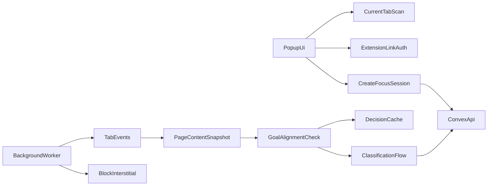

# Chrome Extension Plan

## Goal

- Add a separate React-based Chrome extension that starts a focus session with explicit **session goals**, captures **meaningful page content** from the active tab (not just URL/title), and determines whether that content **aligns with those goals**.
- When the current page’s content does **not** align with the active session goals, **stop the user from staying on that tab**—typically by redirecting to the extension’s blocked/interstitial page until the tab is allowed or the session ends.
- Summarize open tabs for context, classify relevance using goal + content (with tiered local/backend checks), and surface decisions to the realtime dashboard.

## Scope

1. Create a dedicated extension workspace inside the repo.
2. Build the popup UI with React and shadcn-style components; capture **session goals** and **page content** for alignment checks.
3. Add a background service worker for tab watching, **content snapshotting**, goal-aligned enforcement, and redirects when content is off-goal.
4. Integrate the extension with Convex for session creation, classification (goals + content), and realtime dashboard updates.

## Extension Architecture

## Implementation Plan

1. Create the extension workspace as a separate frontend in the repo.

- Add an `[extension/](extension/)` directory with:
  - `manifest.json`
  - popup entrypoint
  - background service worker
  - blocked/interstitial page
  - shared extension utilities
- Keep it separate from the Next build so extension packaging stays predictable.

2. Build the popup UI for session kickoff.

- Use React with a compact popup layout and shadcn-style components.
- On popup open:
  - query current tabs with `chrome.tabs.query`
  - gather descriptors (title, URL, hostname) **and**, where permitted by `manifest` permissions, a **page content snapshot** for the active tab (e.g. via `chrome.scripting` + DOM/readability-style extraction, subject to host permissions and user gesture rules)
  - display a short summary of current browsing context, including that content is used for goal alignment
- After the user enters **session goals**, send goals plus tab metadata and any initial content excerpts to the backend for classification.
- Show each tab as `allowed`, `blocked`, or `checking`.

3. Add extension auth/linking instead of running full WorkOS directly in the popup.

- Accept a short-lived linking code or token generated from the web dashboard.
- Store the resulting extension session/token locally in extension storage.
- Use that linked identity for all Convex calls from the popup/background worker.

4. Move enforcement logic into the background worker.

- Listen to `chrome.tabs.onUpdated`, `chrome.tabs.onActivated`, and related events.
- For each navigation or activation while a focus session is active: obtain an up-to-date **snapshot of the page content** for that tab (same extraction path as the popup, with debouncing/caching to avoid excessive work).
- Run a **goal alignment** step: compare session goals to that content (plus URL/title as signals). If content does **not** align with the goals, **prevent the user from continuing on that tab** by redirecting to the extension-owned blocked/interstitial page.
- Re-check when the URL or document finishes loading so SPAs and soft navigations are covered where feasible.
- Redirect irrelevant tabs to an extension-owned blocked page instead of banning a whole site globally when a single page is off-goal but the domain might sometimes be allowed.
- Keep the popup focused on user input and state display, not long-running tab monitoring.

5. Implement a fast, tiered classification path.

- Treat **session goals + page content** (and optionally title/URL) as the primary inputs for “aligned vs not aligned.”
- First use local heuristics and cache:
  - exact domains/pages already allowed in this session
  - repeated distractor URLs or content hashes already blocked in this session
  - manual overrides
- Only escalate uncertain cases to the backend OpenRouter classification action, passing **goal text + content excerpt** so the model can judge alignment, not just domain category.
- Persist the final verdict, reason, and confidence so the dashboard can explain decisions.

6. Add the block-page UX and manual override.

- Show the user why the tab was blocked: **which session goals** the **page content** was judged not to support (and short evidence, e.g. snippet or summary).
- Provide a temporary allow/override action for the current session.
- Sync the override back to Convex so future checks in the same session stay consistent.

## Key Files

- `[extension/manifest.json](extension/manifest.json)`
- `[extension/src/popup/](extension/src/popup/)`
- `[extension/src/background/](extension/src/background/)`
- `[extension/src/blocked/](extension/src/blocked/)`
- `[extension/src/lib/](extension/src/lib/)`

## Validation

- Verify the popup loads and reads the current tab set and can obtain a **page content snapshot** for the active tab (within permission limits).
- Verify opening the popup generates a sensible summary of current browsing that reflects content-aware context, not only the URL.
- Verify entering **session goals** produces relevance / alignment decisions for open tabs using goal + content signals.
- Verify that when the user navigates to or focuses a tab whose **content does not align** with session goals, they are **stopped from staying on that tab** (redirect to blocked page).
- Verify manual allow overrides work and are reflected in later checks.
- Verify the extension sends events that appear live in the dashboard.
